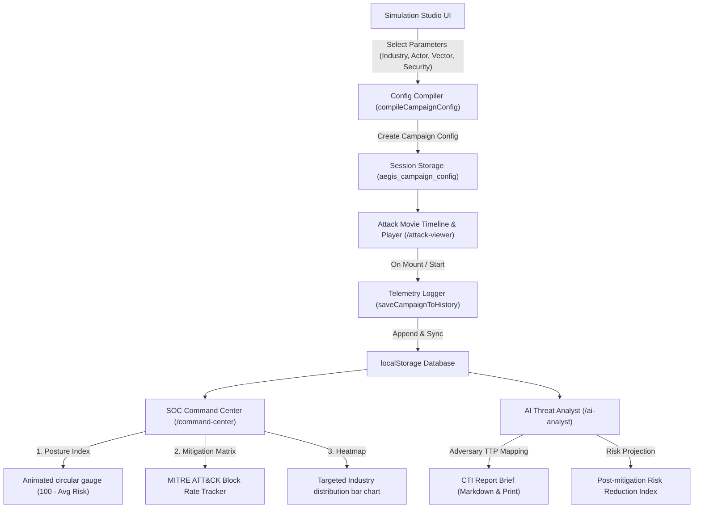

# 🛡️ AEGIS: AI-Powered Cyber Threat Simulation & Defense Platform

AEGIS is an immersive, educational cybersecurity digital twin and threat emulation platform. It allows students, recruiters, and security enthusiasts to configure, simulate, and analyze advanced persistent threat (APT) campaigns inside a clean, visual digital twin environment. By mapping threat propagation to the MITRE ATT&CK matrix, AEGIS generates live simulation playbacks, reports real-time security posture metrics, and synthesizes Cyber Threat Intelligence (CTI) mitigation playbooks.

---

## 🚀 Key Features

*   **🎬 Intrusion Playback Player & Timeline**: Watch deterministic, multi-stage cyber campaigns unfold across network topologies. Stream live EDR events, LSASS credential dumps, and lateral subnet logs in real-time.
*   **🎛️ Simulation Studio**: Customize parameters like targeted industries (Healthcare, Banking, Government, University, Startup), adversarial actors (APT29, Lazarus, LockBit, FIN7, Anonymous), intrusion vectors (Phishing, SQLi, DDoS, Supply Chain, Ransomware), and zero-trust security profiles.
*   **📊 SOC Command Center**: An operations dashboard reporting a dynamic Security Posture Index, threat volume metrics, targeted industry heatmaps, MITRE ATT&CK mitigation coverages, and historical telemetry tables.
*   **🧠 AI Threat Analyst Console**: Synthesizes highly structured, realistic Cyber Threat Intelligence (CTI) briefs. Includes 30-second executive summaries, business impact assessments (downtime & financial liabilities), mitigation playbooks, and quantitative risk-reduction gauges.
*   **📝 Telemetry Exporters**: Support for exporting complete CTI reports as clean Markdown briefs or triggering print-ready SOC paper copies.

---

## 📐 System Architecture

The following diagram illustrates how simulation parameters propagate through the AEGIS compiler, populate execution timelines, record telemetry, and feed analytical consoles:



---

## 🛠️ Tech Stack

AEGIS is built using a modern, performant frontend stack optimized for cinematic micro-interactions:

*   **Core Framework**: Next.js v16.2.9 & React 19 (App Router)
*   **Styling & Design System**: Tailwind CSS v4 & custom utility styles (CRT scanline sweeps, digital twin grid meshes, glassmorphism templates)
*   **Animations**: Framer Motion (smooth state transitions, circular gauges, and timeline expansions)
*   **Icons**: Lucide React
*   **Language**: TypeScript (strict type safety for configuration payloads)

---

## 📊 MITRE ATT&CK Mapping Matrix

AEGIS simulations map cyber kill chains directly to corporate threat vectors, tracking detection and block rates for these core techniques:

| Intrusion Phase | MITRE ID | Technique Name | Defense Focus / Countermeasure |
| :--- | :--- | :--- | :--- |
| **Reconnaissance** | `T1595` / `T1046` | Active Scanning / Port Scans | Boundary Firewalls & Rate-Limiting |
| **Initial Access** | `T1566.002` | Spearphishing Link | Heuristic Email Sandbox / FIDO2 MFA |
| **Initial Access** | `T1195.002` | Supply Chain Compromise | Dependency check-sum pinning & scanners |
| **Initial Access** | `T1190` | Exploit Public-Facing App | Web Application Firewall (WAF) |
| **Credential Access** | `T1003.001` | LSASS Memory Dumping | Windows Host Credential Guard |
| **Lateral Movement**| `T1021` | Remote Services (RDP/SSH) | Active Directory Session Limits |
| **Privilege Escalation**| `T1134` | Access Token Manipulation | Principle of Least Privilege |
| **Exfiltration** | `T1041` | Exfiltration Over C2 | Egress Port Filtering & DNS inspection |
| **Impact** | `T1486` | Data Encrypted for Impact | Immutable WORM Backups |
| **Impact** | `T1498.001` | Volumetric DDoS Flood | Global Edge Scrubbers |

---

## 📥 Installation & Setup

Verify that you have [Node.js](https://nodejs.org) installed, then execute the following console commands:

1.  **Clone the repository**:
    ```bash
    git clone https://github.com/utkarshsingh3011/AEGIS-ai-cyber-simulator.git
    cd AEGIS-ai-cyber-simulator
    ```

2.  **Install dependencies**:
    ```bash
    npm install
    ```

3.  **Run the local development server**:
    ```bash
    npm run dev
    ```

4.  **Open the interface**:
    Navigate to `http://localhost:3000` inside your browser to start the console.

5.  **Compile production bundle**:
    ```bash
    npm run build
    ```

---

## 🗺️ Future Roadmap

*   🤖 **Gemini AI scenario generator**: Connect a live Gemini API endpoint to dynamically synthesize custom adversary logs, bypass codes, and complex CTI playbook text based on unstructured user requests.
*   📡 **SIEM Webhook Connector**: Stream simulated attack logs over Syslog or HTTP POST endpoints to live SIEM tools like Splunk or Elastic Stack.
*   🔏 **Infrastructure-as-Code Playbooks**: Generate downloadable Terraform scripts to automatically deploy the recommended mitigations on AWS, GCP, or Azure.

---

## 💡 Why I Built This

Cybersecurity threats are fast, invisible, and highly complex. Most defense simulations exist only as static text print-outs or dry tabular audits. **AEGIS** was built to bridge the gap between cybersecurity and interactive visualization. By turning abstract adversarial campaigns into structured, cinematic movies, AEGIS makes it easy to understand the mechanics of lateral movement, privilege escalation, and zero-trust defense architectures. 

It is designed to educate security operators, engage executives, and pave the way for automated AI-driven defenses.
